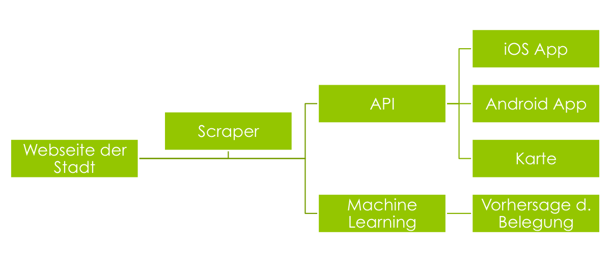

# ParkplaetzeDD
Analyse und Machine Learning mit offenen Parkplatzdaten aus Dresden

read about it here: http://mechlab-engineering.de/2015/03/vorhersage-der-parkhausbelegung-mit-offenen-daten

This is part of some bigger #OpenData thing

* Scraper: https://github.com/RobTranquillo/parkplaetzeDD
* iOS App: https://github.com/kiliankoe/ParkenDD
* Android App: https://github.com/jklmnn/ParkenDD
* Map: http://ubahn.draco.uberspace.de/opendata/ui/